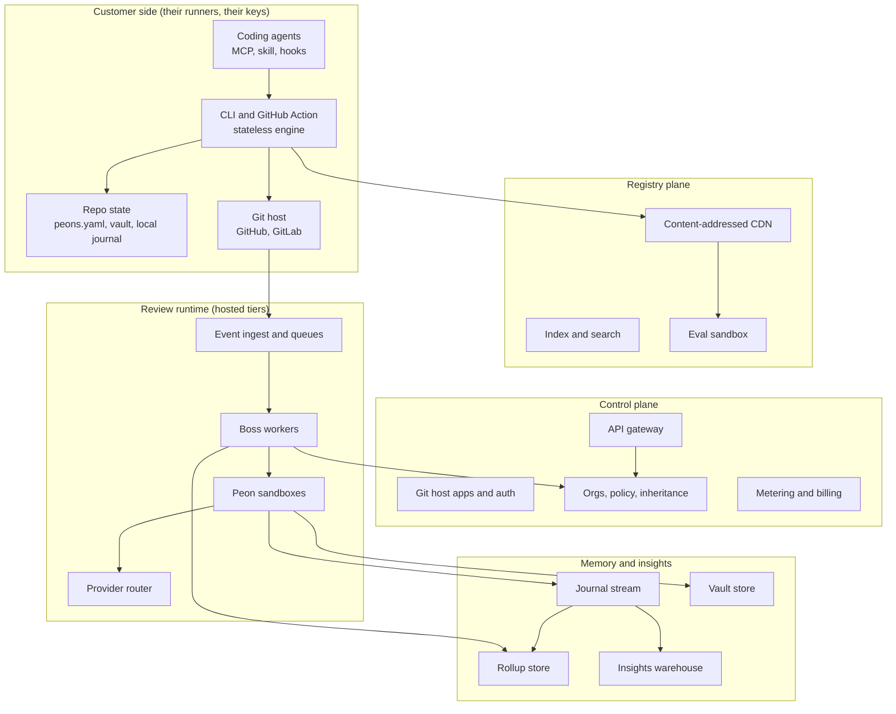
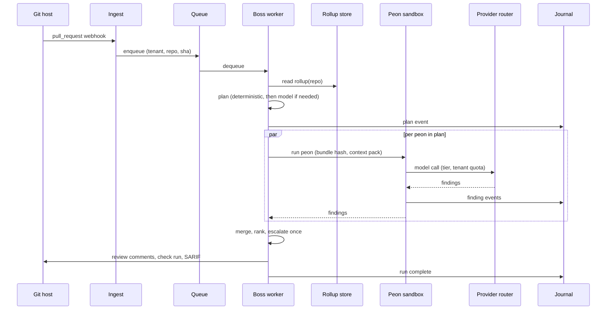

# RFC-0001: ci-peons system architecture

| | |
|---|---|
| Status | Draft |
| Author | Dan Neciu |
| Created | 2026-09-15 |
| Scope | Target architecture for the finished product serving millions of developers. Describes the end state; the rollout section says what ships first. |
| Reviewers | TBD |

## 1. Summary

ci-peons is an open source platform for specialised, testable AI code reviewers ("peons") that run in CI, in a CLI, and as tools coding agents call. This RFC defines the system as five planes: a customer-side engine that runs on the customer's infrastructure with the customer's keys, a git-native registry, a thin multi-tenant control plane, a horizontally scaled review runtime for hosted tiers, and a memory plane that makes routing better per repository over time.

The load-bearing decision is local-first. The free tier never calls our servers for a review. Hosted infrastructure carries only paid workloads and the registry, which keeps the cost of serving millions of free users close to the cost of a CDN.

## 2. Goals and non-goals

### Goals

- G1. Identical review results whether a peon runs in CI, in the CLI, or via MCP. One engine, three surfaces.
- G2. Targeted runs complete in under 60 seconds and cost cents on a Sonnet-class model, so agents can call peons on every iteration.
- G3. No customer code is stored by ci-peons unless the customer opts into a hosted feature that requires it, and then only in the customer's region and encrypted with a per-tenant key.
- G4. Every hosted component is stateless or backed by a rebuildable derived store. No singleton holds per-repo state in process memory.
- G5. The system runs at 25x its launch load without a redesign of any plane (see section 9).
- G6. Third-party peons are installed and executed with the same trust model as packages: declared permissions, content-hash pinning, sandboxed execution.

### Non-goals

- Replacing human review or merge authority. Peons produce findings and an exit code; humans and branch protection decide.
- Full-repository embedding indexes. The vault (section 6.5) is a symbol and ownership graph in markdown. Embeddings over vault notes are a possible later layer, not part of this design.
- Supporting every language in v1. The vault builder targets TypeScript and JavaScript first. Other languages get path-scoped peons without vault context until their builders exist.
- IDE extensions. Editors reach peons through the CLI and MCP.

## 3. Background and constraints

- Review volume is now dominated by agent-authored PRs: many small PRs, opened at all hours, at roughly 25x the CI job volume of two quarters earlier in agent-heavy organisations. The system must assume bursty, high-frequency load from a minority of tenants.
- Existing reviewers run one generic pass per PR and charge per seat or per review. Their cost structure cannot follow a targeted, per-concern model. Ours must.
- Anthropic's test impact analysis redesign (September 2026) is the reference for the memory plane: listener workers append to a journal, a consumer rolls up per-key history, a selector reads the rollup. State lives outside the process.
- The founder is one person plus a contractor for year one. The architecture must be buildable incrementally; section 12 orders it.

## 4. Design principles

1. Local-first. If a feature can run on the customer's runner with the customer's key, it does. Hosted services add coordination, memory across repos, and trust, never the review itself.
2. Content-addressed everything. Peons, context packs, vault snapshots and eval results are keyed by hash. Caching, reproducibility and lockfiles fall out of this.
3. Deterministic before probabilistic. Path routing, permissions, severity gates and fixtures are deterministic. A model is consulted only where globs cannot express the decision.
4. Derived data is disposable. Rollups, vault snapshots and dashboards rebuild from git plus the journal. Only the journal is a system of record, and it is append-only.
5. Explain every decision. Anything the Boss does is printed with a reason and a source. Anything a peon flags cites the check and the context line that triggered it.

## 5. System overview



Plane ownership and hosting:

| Plane | Runs where | Holds customer code | Scales on |
|---|---|---|---|
| Customer side | Customer runners and machines | Yes, never leaves | n/a |
| Registry | Our CDN and a small index service | No | Cache hit rate |
| Control plane | Our regions, multi-tenant | No | Tenants |
| Review runtime | Our regions, per-tenant sandboxes | Transiently, in memory, in the tenant's region | Queue depth |
| Memory and insights | Our regions, per-tenant encryption | Findings and vault notes, not source | Event rate |

## 6. Component design

### 6.1 Engine (customer side)

One TypeScript package, `@ci-peons/core`, with no network dependency other than the model provider and the git host. Compiled with Bun into a single static binary for the CLI so installation needs no Node runtime. The GitHub Action and GitLab CI component are thin wrappers that download the pinned binary and call it.

Responsibilities:

- Load `peons.yaml`, resolve `extends:` chains, resolve peon references to content hashes via `peons.lock`.
- Compute the change set (staged, branch against base, or PR) and cluster changed files by owning path group.
- Run the Boss planner locally (section 6.4) using the local rollup if present.
- Assemble a context pack per cluster from the vault and the peon's `context:` declaration, capped by a token budget.
- Execute peons in parallel, each in a restricted subprocess whose filesystem access is limited to the peon's `permissions.read` globs.
- Redact secrets from anything that will be sent to a provider (section 10).
- Format output: `agent` (markdown fix instructions), `json`, `sarif`, `github-review` (inline comments via the API), `gitlab-notes`.
- Append run events to `.peons/journal/` when running locally, or emit them to the hosted ingest when a hosted token is present.
- Exit with 0 when no finding meets the configured block severity, 1 otherwise, 2 on engine error.

Invariant: the same inputs (change set, peons at the same hashes, vault at the same sha, model and temperature) produce the same findings modulo model nondeterminism. CI and local must not diverge in routing, context or permissions.

### 6.2 Peon specification

A peon is a markdown file with YAML frontmatter and a body of checks.

```yaml
---
name: events-domain
version: 1.3.0
description: Booking and event lifecycle invariants for the events team
paths: ["apps/events/**"]
severity:
  default: medium
  block: critical
permissions:
  read: ["apps/events/**", "docs/adr/**", "docs/incidents/**"]
  tools: [grep, read_file]          # no shell, no network
context:
  team: events
  docs: ["docs/adr/00*-events-*.md"]
  incidents: ["docs/incidents/*.md"]
  history: { prs: 20, since: 90d }
  tests: ["apps/events/**/*.test.ts"]
model:
  tier: fast                        # fast | balanced | deep, mapped by the provider router
                                    # (a fourth tier, decision, is reserved for the Boss and the outcome consumer)
fixtures: ./fixtures
---

## Checks
- Every write to bookings goes through `withIdempotency`. Cite the ADR when flagging.
- Event mutations emit an audit entry via `audit.record`.
- No direct Stripe calls outside `apps/events/billing`.
```

Rules:

- `permissions` is enforced by the runner, never by the prompt. A peon that reads outside its globs fails the run.
- `fixtures/should-flag/*` and `fixtures/should-pass/*` are required for a verified listing. `peons test` reports precision and recall against them.
- `model.tier` is a request, not a model name. The provider router maps tiers to concrete models per tenant so vendors do not hardcode a provider.
- Vendors publish from a git repo. `peons add github:owner/repo/name@1.3.0` resolves the tag, fetches the bundle by content hash from the CDN, and writes the hash to `peons.lock`.

### 6.3 Configuration and inheritance

`peons.yaml` at the repo root. Organisations publish a shared set that repos extend.

```yaml
extends: github:perk/peons@2026.09
provider: anthropic                 # key from PEONS_API_KEY or the hosted vault
boss:
  budget: { max_peons: 5, max_cost_usd: 0.50 }
  always: [security]
  never_skip: ["apps/billing/**"]
peons:
  - use: a11y
    paths: ["apps/web/**"]
  - use: ./peons/events-domain.md
  - use: react
    severity: { block: high }       # override
  - use: performance
    enabled: false
    reason: "Perf reviewed in the weekly bundle report"
```

Resolution order: org set, then repo file, then CLI flags. A repo may raise severity or add peons freely; it may lower severity or disable an org peon only when the org set marks it `overridable: true`. Disables require a `reason`, which is printed in `peons plan` and stored in the journal so platform teams can see who opted out of what.

### 6.4 Boss

The Boss is a router and a merger. It never reads the full diff with a large model.

Inputs: changed file list with line counts, PR title and body, labels, `peons.yaml` after resolution, peon descriptions, team map (from `teams.yaml` or CODEOWNERS), the rollup for this repo.

Plan stage, in order:

1. Path routing. Deterministic. Each changed file matches zero or more peons by glob.
2. Rollup pruning. Drop a peon on a cluster when it has been clean on that surface for N merges and no file in its `paths` changed. Keep it when the cluster touches a file that had a finding in the last M runs.
3. Heuristic triggers. Regex-level signals on the diff (new route handler, raw SQL, `dangerouslySetInnerHTML`, new dependency, auth middleware touched) that add peons the globs missed.
4. Decision routing. A `decision`-tier model (section 6.8) sees a small state: the file list with line counts and owners, the PR title, body and labels, one-line vault summaries for touched modules, and the peon catalog with descriptions. It answers a fixed set of typed questions in one parallel call: one Noul per peon ("does this change need the X reviewer"), Nouls for `touches_auth` and `new_endpoint`, a Score for change risk, and a Choice for review depth. Code turns the answers into the plan: dispatch a peon above its threshold, add `security` when auth or endpoint signals are high, pick the tier from the depth answer. Any decisive answer in the low-confidence band is escalated to a `fast` LLM for that one decision, or resolved conservatively (dispatch) when the peon is cheap. The diff is never part of this state; decision models lose accuracy on irrelevant content and the plan does not need it. This step is skipped when steps 1 to 3 already produce a plan within budget.
5. Hard rules. `always` peons are added; `never_skip` paths cannot be pruned. The budget cap is applied last.

Merge stage: findings are deduplicated by (file, line range, check id), then near-duplicates across peons are resolved with a `decision`-tier Noul ("are findings A and B the same issue"), ranked by severity then by peon precision from the rollup, and capped per PR. A second Noul ("is this finding actionable rather than stylistic") feeds the ranking but never removes a finding above `severity.block`. One escalation round is permitted: a critical finding on a file whose vault note lists request handling or auth dependents triggers `security` if it was not in the plan. No second round.

Every plan is emitted as a `plan` event and printed by `peons plan`, with the probability from the decision model next to each routed peon so the reason is a number, not prose.

### 6.5 Vault

A markdown index of the codebase in `.peons/vault/`, one note per module, committed or generated in CI.

```markdown
---
path: apps/events/api/createBooking.ts
owners: [events]
imports: [withIdempotency, BookingRepo]
imported_by: [BookingForm, waitlistWorker]
tests: [apps/events/api/createBooking.test.ts]
adrs: [docs/adr/007-idempotent-writes.md]
incidents: [docs/incidents/2026-07-double-booking.md]
findings: { accepted: 3, dismissed: 1, last_clean_sha: 9f1c2a }
---
Creates a booking. Idempotent since July; key from the request header.
Waitlist path added in #412.
```

Builder: `peons index` walks the TypeScript program via the compiler API for imports and exports, reads CODEOWNERS for owners, matches test files by convention, and links ADRs and incidents by path reference or by a `refs:` block in those documents. Incremental: on merge, rebuild notes for touched files and their direct dependents. The prose section is model-written once and only regenerated when the file's exported surface changes.

Storage: in the repo by default (readable and correctable by humans and agents). On hosted tiers, snapshots are also stored per repo keyed by commit sha so the runtime does not need a checkout to plan.

### 6.6 Registry plane

- Sources: any git repository. The index crawls repositories that opted in via a `peons-publish` webhook or a GitHub App install.
- Index service: Postgres plus a search index. Holds metadata, versions, content hashes, eval scores, verified status. No peon bodies.
- Content CDN: immutable bundles at `/p/{sha256}`. Edge-cached. The CLI verifies the hash after download.
- Eval sandbox: on every published version, run the peon's fixtures against a fixed model set in an isolated job, record precision and recall, and gate the verified badge on thresholds (precision 0.85, recall 0.7 at launch). Results are public.
- Trust: a peon's requested `permissions` are shown in the index and printed on install. The runner refuses a bundle whose permissions differ from the lockfile entry.

### 6.7 Control plane

Thin services, all stateless behind Postgres:

- Git host apps: GitHub App and GitLab application for installation, identity, and webhook delivery.
- Orgs and policy: tenants, repos, seats, org peon sets, override rules, region pin.
- Metering: seat counts, hosted run counts, hosted inference pass-through.
- API gateway: per-tenant rate limits, token exchange for the CLI (`peons login`), signed URLs for vault snapshots.

The control plane never receives source code. It receives metadata about PRs and runs.

### 6.8 Review runtime (hosted tiers)

Used when a tenant enables hosted runs (Team) or when an org wants runs off their CI minutes.



Workers:

- Ingest: validates webhook signatures, deduplicates by (repo, sha, event), enqueues. Idempotent.
- Queue: per-tenant partitions so one tenant's burst cannot starve others. NATS JetStream or SQS FIFO; the choice is an ops decision, the contract is at-least-once delivery with idempotent consumers.
- Boss workers: stateless, scale on queue depth. Read the rollup from a low-latency KV (Redis or DynamoDB) and vault snapshots from object storage.
- Peon sandboxes: one microVM (Firecracker class) per run, tenant key injected from KMS at start, no persistent disk, network allow-list limited to the provider router and the git host. Destroyed after the run.
- Provider router: maps `model.tier` to concrete models per tenant, applies per-tenant quotas, retries with fallback across Anthropic, OpenAI, Bedrock and Vertex, and records cost per run. Tenants may pin a single provider or bring their own endpoint.
- Decision tier: `decision` maps to a System One model (TypeSafe's Jev at launch: typed Choice, Score and Noul answers with calibrated confidence, all questions in a request evaluated in parallel, 70 to 500 ms, $0.042 per million input tokens, output free). The router falls back to a `fast` LLM with structured output when the decision provider is unavailable or a tenant disables it, so the Boss never has a hard dependency on a single early-access vendor. Decision calls are cheap enough to run on every agent iteration, not only on PRs, which is what lets the local CLI plan the same way the hosted runtime does.

### 6.9 Memory plane

Modelled on Anthropic's test selection service after its redesign.

- Journal: append-only event stream, partitioned by tenant. Event types: `plan`, `finding`, `outcome`, `run_complete`, `override`. Retention configurable per tenant; default 400 days. Backed by Kafka-compatible storage with tiered retention to object storage.
- Rollup consumer: a small stateless process that folds events into per (tenant, repo, peon, path_prefix) aggregates: runs, findings, accepted, dismissed, suppressed, reverted, last clean sha, precision. Writes to the KV the Boss reads. Rebuildable by replay.
- Outcome derivation: a separate consumer watches git and PR events and emits `outcome` events: a finding is `accepted` when a subsequent push addresses it, `dismissed` when resolved without change or thumbed down, `reverted` when the PR is later reverted. "Addressed" is a `decision`-tier Noul over the finding and the diff hunk that touched its range, with the line-overlap heuristic as fallback; the answer's confidence is stored on the event so low-confidence outcomes weigh less in the rollup. This is what turns findings into a training signal without any human labelling.
- Vault store: immutable snapshots per repo per sha in object storage plus a Postgres index. Built by index workers on merge.
- Insights warehouse: ClickHouse fed from the journal. Serves dashboards, Slack digests, precision leaderboards and the vendor eval reports.

Local mode uses the same event schema written to `.peons/journal/*.jsonl` and a rollup computed at run time. Moving from local to hosted is a change of sink, not of format.

## 7. Data model

### 7.1 Journal event

```ts
type PeonEvent =
  | { type: "plan"; run: RunRef; peons: PlannedPeon[]; budget: Budget; reasons: Reason[] }
  | { type: "finding"; run: RunRef; peon: PeonRef; id: string; file: string; range: [number, number];
      check: string; severity: Severity; evidence: string[]; fingerprint: string }
  | { type: "outcome"; finding: string; kind: "accepted" | "dismissed" | "suppressed" | "reverted";
      by: "git" | "user" | "policy" | "decision"; confidence?: number; at: string }
  | { type: "override"; repo: string; peon: string; field: string; reason: string; by: string }
  | { type: "run_complete"; run: RunRef; findings: number; cost_usd: number; duration_ms: number; exit: 0 | 1 | 2 };

type RunRef = { tenant: string; repo: string; sha: string; base?: string; surface: "ci" | "cli" | "mcp" };
type PeonRef = { name: string; hash: string; version: string };
type Severity = "info" | "low" | "medium" | "high" | "critical";
```

`fingerprint` is a hash of (check, normalised code around the range) so the same finding survives line shifts across pushes and can be matched to outcomes.

### 7.2 Rollup record

```ts
type Rollup = {
  key: { tenant: string; repo: string; peon: string; pathPrefix: string };
  runs: number; findings: number; accepted: number; dismissed: number; suppressed: number; reverted: number;
  precision: number;               // accepted / (accepted + dismissed)
  lastCleanSha?: string; lastFindingSha?: string;
  updatedAt: string;
};
```

### 7.3 Control plane entities

Tenant, Installation, Repo (with region pin and vault settings), OrgPeonSet (versioned), Seat, Plan, HostedRunQuota, ProviderBinding (tier to model mapping, BYO endpoint).

## 8. Key flows

### 8.1 Agent iteration loop (local, free tier)

1. Agent edits files, stages them.
2. Stop hook or skill runs `peons run --auto --scope staged --format agent`.
3. Engine plans from globs and the local rollup, assembles context from the vault, runs one to three peons in parallel.
4. Findings return as fix instructions in under a minute. Exit code 1 if anything blocks.
5. Agent fixes and re-runs. Journal appends locally. No network traffic except provider calls.

### 8.2 Pull request gate (CI, free tier)

Same engine in the Action. Adds `--format github-review` to post inline comments and a check run, and `--format sarif` for the code scanning tab. The check run is the branch-protection gate.

### 8.3 Hosted run (Team tier)

Section 6.8. Adds cross-repo rollups, org policy resolution from the control plane, and the outcome consumer so precision improves without anyone thumbing findings.

### 8.4 Publishing a peon

1. Vendor tags a release in their repo.
2. Webhook triggers the index crawler; bundle is built, hashed, pushed to the CDN.
3. Eval sandbox runs fixtures on the fixed model set; scores are recorded.
4. Index updates version, hash, permissions, scores; verified badge granted or withheld.
5. Consumers upgrade explicitly via `peons update`; lockfiles never move on their own.

### 8.5 Vault refresh

On merge to the default branch, the Action (or an index worker on hosted tiers) rebuilds notes for changed files and their dependents, commits to `.peons/vault/` or writes a snapshot keyed by sha.

## 9. Capacity model

Planning targets for the hosted planes at the "millions of developers" end state. Free-tier runs are excluded because they do not touch these planes.

| Quantity | Assumption | Derived |
|---|---|---|
| Developers on paid tiers | 300,000 | |
| Hosted PRs per developer per day | 3 (agent-heavy) | 900,000 PRs/day |
| Runs per PR (pushes, re-runs) | 2.5 | 2.25M runs/day, ~26/s average |
| Peak multiplier | 10x (overnight agent bursts, Monday mornings) | ~260 runs/s peak |
| Peons per run | 2.2 | ~570 sandbox starts/s peak |
| Journal events per run | 12 | ~3,100 events/s peak |
| Rollup keys | tenants x repos x peons x prefixes | tens of millions, KV-sized |
| Vault snapshot writes | 1 per merge, ~0.4 merges per PR | ~360k snapshots/day |
| Decision-tier calls | 1 plan + ~2 merge + ~1 outcome per run | ~9M calls/day, ~1,000/s peak, sub-second each |

Consequences:

- Sandbox start latency dominates. Pre-warmed microVM pools per region with a target of 500 ms to first token.
- The provider router must shape traffic per tenant and per provider; at peak we are a large customer of every provider and will hit account limits before hardware limits.
- Journal ingest at ~3k events/s is small for Kafka-class storage. The design constraint is not throughput, it is never letting a consumer fall behind, which is exactly the failure Anthropic described. Consumers are stateless, partitioned per tenant, and lag is a paged metric.
- Assume 25x within two quarters of any given load. Every plane above scales by adding instances behind a queue or a KV; none requires a redesign.

## 10. Security and tenancy

- Isolation: one microVM per peon run, tenant-scoped provider credentials from KMS, no shared filesystem, egress allow-list.
- Code handling: source enters the runtime only inside the sandbox and only for the changed files plus the context pack. It is never written to disk or to the journal. Findings contain evidence snippets capped at a few lines; tenants can disable evidence storage.
- Secret redaction: the engine scans the change set and context pack with a secret detector before any provider call and replaces matches with typed placeholders. Redaction happens on the customer side for local runs and inside the sandbox for hosted runs.
- Peon permissions: enforced by the runner via filesystem and tool allow-lists. Publishers cannot escalate silently; a permission change is a new version with a new hash and a diff shown on `peons update`.
- Prompt injection: peons treat file contents as data. The Boss's model step never sees file contents, only names and stats. Findings that instruct the agent to take actions outside the changed files are dropped by a post-filter.
- Residency: tenants pin a region; the runtime, journal, vault store and warehouse for that tenant live there. The registry is global and holds no customer data.
- Self-hosting: the Enterprise tier ships the runtime, memory plane and a private registry as the same containers we run, deployable in the customer's cloud.

## 11. Reliability and operations

- SLOs: hosted run p50 under 60 s and p95 under 3 minutes for targeted runs; check-run posted within 5 minutes of webhook at p99; journal consumer lag under 60 s at p99; registry CDN availability 99.99%.
- Failure modes: provider outage degrades to fallback providers, then to "check run neutral with explanation"; queue backlog scales workers and alerts at tenant level; rollup KV loss rebuilds from journal replay; vault snapshot missing falls back to a shallow checkout inside the sandbox.
- Observability: every run carries a trace id from webhook to check run; per-tenant cost, latency and precision are first-class metrics; consumer lag and sandbox pool depth are paged.
- Instrumentation is designed so an agent can operate it: metrics and logs are structured, and the runbooks are executable by Claude Code against the same APIs.

## 12. Rollout

Ordered by dependency and by what one person can ship.

1. Engine, CLI, GitHub Action, five launch peons with fixtures, `peons test`, local journal. Everything in section 6.1 and 6.2. No hosted components.
2. Registry: git sources, lockfile, CDN, index with search. Eval sandbox for verified badges.
3. Boss with deterministic routing and rollup pruning from the local journal. `peons plan`.
4. Vault builder for TypeScript. Context packs.
5. Control plane and Team tier: GitHub App, org peon sets, hosted journal and rollup, Slack digests.
6. Review runtime for hosted runs, provider router, outcome consumer.
7. Boss model routing and escalation, learning from outcomes.
8. GitLab, Enterprise self-hosting, additional vault builders.

Each step is usable on its own; none requires the next to deliver value.

## 13. Alternatives considered

- Hosted-only architecture (like CodeRabbit). Rejected: free tier would cost us inference and infrastructure per run, and the per-concern price point would be impossible.
- Embedding index of the codebase (like early Cursor). Rejected for v1: stale under agent merge volume, opaque to users, expensive to maintain for millions of repos. The symbol graph plus ownership and history covers the routing and context needs for the JS/TS wedge.
- Single "super reviewer" with dynamic prompts instead of many peons. Rejected: cannot be fixture-tested per concern, cannot be selectively invoked by agents, and reproduces the noise problem.
- Storing peons in our registry rather than in git. Rejected: adds an upload flow and a trust boundary we do not need; git already gives identity, history and review of the peon itself.
- Long-lived per-repo worker processes holding rollup state in memory. Rejected: this is the singleton that Anthropic's CI post spent six months patching.
- LLM with JSON output for Boss routing. Kept as the fallback only. A System One model answers the same typed questions two orders of magnitude faster and cheaper with calibrated confidence, and the confidence band gives a principled escalation rule that JSON-from-an-LLM does not.

## 14. Open questions

- Q1. Should the vault be committed to the repo by default or generated in CI and stored only as snapshots? Committing gives humans and agents a readable artefact and a diff; it also adds churn to PRs. Current lean: committed, with a bot-authored commit on merge.
- Q2. Fixed model set for eval scoring: how often to rotate, and how to keep vendor scores comparable across rotations.
- Q3. Outcome derivation precision: how reliable is "lines changed after the finding" as an acceptance signal for large refactors. May need a confidence field on `outcome` events.
- Q4. Per-tenant provider quotas versus our own account limits at peak. Whether to require BYO provider accounts above a run threshold.
- Q5. Escalation policy: whether one round is enough for security-critical repos, or whether `never_skip` paths should allow a second round at the tenant's cost.
- Q6. Decision-tier thresholds: per-peon dispatch thresholds start at a global default and should move per repo as the rollup accumulates outcomes. Whether to tune them ourselves or expose them in `peons.yaml`. Also whether Jev's self-reported accuracy (about 68% on its own benchmark) holds on our routing questions; a fixture set for the Boss, like the ones peons carry, is needed before it becomes the default path.

## 15. Risks

| Risk | Impact | Mitigation |
|---|---|---|
| Consumer lag in the memory plane | Boss routes on stale precision; noisy rules persist | Stateless partitioned consumers, lag paged, replay tooling from day one |
| Provider rate limits at peak | Runs queue, SLO misses | Multi-provider router, per-tenant quotas, BYO endpoints |
| Malicious or careless third-party peons | Data exfiltration, false findings | Runner-enforced permissions, sandbox egress allow-list, lockfile hashes, eval gating |
| CI and CLI results diverge | Agents stop trusting local runs | Single engine binary, contract tests that run the same fixtures on both surfaces in CI |
| Vault builder cost on large monorepos | Slow merges | Incremental rebuild by dependency closure, snapshot caching by sha |
| Platform vendors ship equivalent features | Differentiation erodes | Provider-agnostic engine, open registry and evals as ecosystem assets, context and memory in the customer's repo |
| Decision-tier vendor is early access and single-source | Boss degrades to slower, costlier routing | `decision` is a router tier with an LLM structured-output fallback; Boss fixtures run against both paths in CI |
